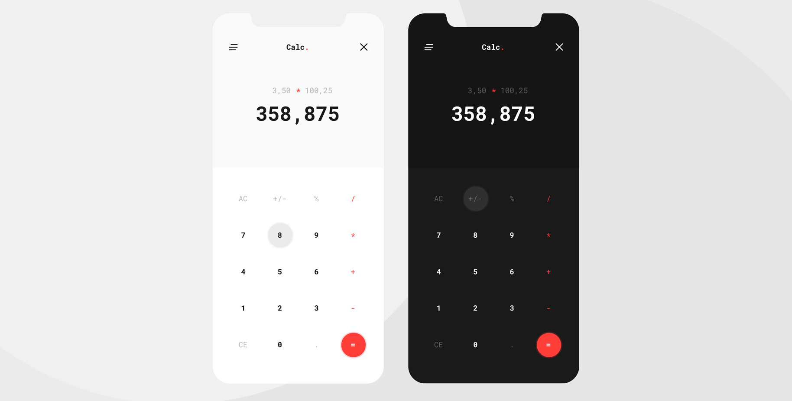

# Calc.

A simple calculator application created with [React](https://reactjs.org/).

## Project Screen Shot

## Installation and Setup Instructions

#### Example:  

Clone down this repository. You will need `node` and `npm` installed globally on your machine.  

Installation:

`npm install`  

To Start Server:

`npm start`  

To Visit App:

`localhost:3000`  

## Authors

* **Claudio Bonfati** - *The one who coded it* - [LinkedIn Profile](https://www.linkedin.com/in/claudiobonfati/)

* **Victor Niculici** - *The one who designed it* - [LinkedIn Profile](https://www.linkedin.com/in/niculici/)

## License

This project is licensed under the [MIT License](https://choosealicense.com/licenses/mit/)